# AWS Serverless News Summarizer - Architecture Diagram

## AWS Architecture Overview

```mermaid
graph TB
    %% External Sources
    subgraph "External Sources"
        NEWS[📰 News Sources<br/>• NewsAPI<br/>• RSS Feeds<br/>• Social Feeds]
    end

    %% Scheduling & Orchestration
    subgraph "Scheduling & Orchestration"
        EB[⏰ Amazon EventBridge<br/>Scheduler<br/>AM/PM Triggers]
        SFN[🔄 AWS Step Functions<br/>State Machine<br/>Orchestration]
    end

    %% Compute Layer
    subgraph "Compute Services"
        L1[⚡ AWS Lambda<br/>Ingestion Function<br/>• Pull APIs/RSS<br/>• Normalize & Dedupe]
        L2[⚡ AWS Lambda<br/>NLP Function<br/>• Text Processing]
        L3[⚡ AWS Lambda<br/>Summarization Function]
        L4[⚡ AWS Lambda<br/>Voice Generation Function]
        L5[⚡ AWS Lambda<br/>Publishing Function]
    end

    %% AI/ML Services
    subgraph "AI/ML Services"
        BEDROCK[🤖 Amazon Bedrock<br/>LLM Summarization<br/>& Analysis]
        COMPREHEND[📊 Amazon Comprehend<br/>NER, Sentiment<br/>Topic Analysis]
        POLLY[🎙️ Amazon Polly<br/>Text-to-Speech<br/>Neural Voices]
    end

    %% Storage Layer
    subgraph "Storage Services"
        S3[🪣 Amazon S3<br/>• Raw Data<br/>• Processed Content<br/>• Audio Files<br/>• Transcripts]
        DDB[🗃️ Amazon DynamoDB<br/>• Metadata<br/>• Index<br/>• Run Logs]
        OS[🔍 OpenSearch Serverless<br/>Full-text Search<br/>Content Discovery]
    end

    %% Security & Secrets
    subgraph "Security Services"
        SM[🔐 AWS Secrets Manager<br/>API Keys & Credentials]
        KMS[🔑 AWS KMS<br/>Encryption Keys]
        IAM[👤 AWS IAM<br/>Least Privilege Access]
    end

    %% Content Delivery
    subgraph "Content Delivery & Web Services"
        CF[🌐 Amazon CloudFront<br/>CDN + Caching]
        WAF[🛡️ AWS WAF<br/>Web Application Firewall]
        AMPLIFY[📱 AWS Amplify<br/>Web App Hosting]
    end

    %% Monitoring & Observability
    subgraph "Monitoring & Observability"
        CW[📊 Amazon CloudWatch<br/>Logs, Metrics, Alarms]
        XRAY[🔍 AWS X-Ray<br/>Distributed Tracing]
        SNS[📧 Amazon SNS<br/>Notifications]
        SQS[📬 Amazon SQS<br/>Dead Letter Queues]
    end

    %% End Users
    subgraph "End Users"
        WEB[💻 Web Application<br/>Desktop/Mobile Browser]
        MOBILE[📱 Mobile PWA<br/>Progressive Web App]
        PODCAST[🎧 Podcast Apps<br/>RSS/Audio Feeds]
    end

    %% Flow Connections
    NEWS --> L1
    EB --> SFN
    SFN --> L1
    SFN --> L2
    SFN --> L3
    SFN --> L4
    SFN --> L5

    L1 --> S3
    L1 --> DDB
    L1 --> SM

    L2 --> COMPREHEND
    L2 --> S3
    
    L3 --> BEDROCK
    L3 --> S3
    
    L4 --> POLLY
    L4 --> S3
    
    L5 --> S3
    L5 --> DDB
    L5 --> OS
    L5 --> CF

    %% Security connections
    SM --> L1
    KMS --> S3
    KMS --> DDB
    KMS --> OS
    IAM --> L1
    IAM --> L2
    IAM --> L3
    IAM --> L4
    IAM --> L5

    %% Content delivery
    CF --> WAF
    CF --> S3
    CF --> AMPLIFY
    
    %% End user access
    CF --> WEB
    CF --> MOBILE
    CF --> PODCAST

    %% Monitoring
    CW --> SNS
    XRAY --> CW
    SQS --> CW
    
    %% Styling
    classDef aws fill:#FF9900,stroke:#232F3E,stroke-width:2px,color:#FFFFFF
    classDef compute fill:#FF9900,stroke:#232F3E,stroke-width:2px,color:#FFFFFF
    classDef storage fill:#3F48CC,stroke:#232F3E,stroke-width:2px,color:#FFFFFF
    classDef ai fill:#01A88D,stroke:#232F3E,stroke-width:2px,color:#FFFFFF
    classDef security fill:#DD344C,stroke:#232F3E,stroke-width:2px,color:#FFFFFF
    classDef users fill:#8C4FFF,stroke:#232F3E,stroke-width:2px,color:#FFFFFF
    
    class EB,SFN aws
    class L1,L2,L3,L4,L5 compute
    class S3,DDB,OS storage
    class BEDROCK,COMPREHEND,POLLY ai
    class SM,KMS,IAM,WAF security
    class WEB,MOBILE,PODCAST users
```

## AWS Service Mapping

| Original Component | AWS Service | Purpose |
|-------------------|-------------|---------|
| EventBridge Scheduler | Amazon EventBridge | Trigger twice-daily execution (AM/PM) |
| Step Functions | AWS Step Functions | Orchestrate the entire workflow |
| Ingestion Lambda | AWS Lambda | Pull from APIs/RSS, normalize data |
| Amazon Bedrock | Amazon Bedrock | LLM-powered summarization and analysis |
| Amazon Comprehend | Amazon Comprehend | NLP processing (optional) |
| Amazon Polly | Amazon Polly | Text-to-speech conversion |
| S3 Storage | Amazon S3 | Store raw data, processed content, audio |
| DynamoDB | Amazon DynamoDB | Metadata, indexing, run logs |
| OpenSearch | OpenSearch Serverless | Full-text search capabilities |
| CloudFront | Amazon CloudFront | Content delivery network |
| Web App Hosting | AWS Amplify | Static web application hosting |
| Security Services | IAM, KMS, Secrets Manager, WAF | Comprehensive security layer |

## Data Flow Architecture

## Key AWS Architecture Benefits

### Serverless & Cost-Effective
- **AWS Lambda**: Pay-per-execution, automatic scaling
- **EventBridge**: Managed scheduling service
- **Step Functions**: Visual workflow orchestration

### AI/ML Integration
- **Amazon Bedrock**: Foundation models for summarization
- **Amazon Comprehend**: Advanced NLP capabilities
- **Amazon Polly**: High-quality text-to-speech

### Scalable Storage
- **Amazon S3**: Virtually unlimited storage with lifecycle policies
- **DynamoDB**: NoSQL database with automatic scaling
- **OpenSearch Serverless**: Managed search without infrastructure

### Security & Compliance
- **AWS IAM**: Fine-grained access control
- **AWS KMS**: Encryption key management
- **AWS Secrets Manager**: Secure credential storage
- **AWS WAF**: Web application protection

### Global Content Delivery
- **Amazon CloudFront**: Global CDN with edge locations
- **AWS Amplify**: Managed web hosting with CI/CD

### Monitoring & Observability
- **Amazon CloudWatch**: Comprehensive monitoring
- **AWS X-Ray**: Distributed tracing
- **Amazon SNS**: Multi-channel notifications