# Simple AWS News Summarizer Architecture

```mermaid
graph LR
    %% Sources
    NEWS[📰 News APIs<br/>RSS Feeds] 
    
    %% Trigger
    SCHEDULE[⏰ EventBridge<br/>Scheduler<br/>AM/PM]
    
    %% Processing
    LAMBDA[⚡ Lambda Functions<br/>Ingest<br/>Summarize<br/>Publish]
    
    %% AI Services
    AI[🤖 AI Services<br/>Bedrock LLM<br/>Polly Voice]
    
    %% Storage
    STORAGE[💾 Storage<br/>S3 Files<br/>DynamoDB Metadata]
    
    %% Delivery
    CDN[🌐 CloudFront<br/>Web Delivery]
    
    %% Users
    USERS[👥 Users<br/>Web/Mobile/Podcast]

    %% Flow
    SCHEDULE --> LAMBDA
    NEWS --> LAMBDA
    LAMBDA --> AI
    LAMBDA --> STORAGE
    AI --> STORAGE
    STORAGE --> CDN
    CDN --> USERS

    %% Styling
    classDef trigger fill:#FF9900,stroke:#000,stroke-width:2px
    classDef compute fill:#FF6B35,stroke:#000,stroke-width:2px
    classDef ai fill:#00C853,stroke:#000,stroke-width:2px
    classDef storage fill:#2196F3,stroke:#000,stroke-width:2px
    classDef delivery fill:#9C27B0,stroke:#000,stroke-width:2px
    
    class SCHEDULE trigger
    class LAMBDA compute
    class AI ai
    class STORAGE storage
    class CDN delivery
```

## Simple Flow
1. **EventBridge** triggers twice daily (AM/PM)
2. **Lambda** pulls news, summarizes with **Bedrock**, creates audio with **Polly**
3. Content stored in **S3**, metadata in **DynamoDB**
4. **CloudFront** delivers to users via web/mobile/podcast

## Core AWS Services
- **EventBridge**: Scheduling
- **Lambda**: Processing
- **Bedrock**: AI Summarization  
- **Polly**: Text-to-Speech
- **S3**: File Storage
- **DynamoDB**: Metadata
- **CloudFront**: Content Delivery